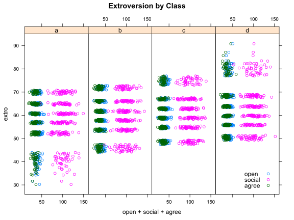

# Introduction

First of all, be warned, the terminology surrounding multilevel models is vastly inconsistent. For
example, multilevel models themselves may be referred to as hierarchical linear models, random
effects models, multilevel models, random intercept models, random slope models, or pooling models.
Depending on the discipline, software used, and the academic literature many of these terms may be
referring to the same general modeling strategy. In this tutorial I will attempt to provide a user
guide to multilevel modeling by demonstrating how to fit multilevel models in R and by attempting to
connect the model fitting procedure to commonly used terminology used regarding these models.

We will cover the following topics: 

- The structure and methods of `merMod` objects
- Extracting random effects of `merMod` objects
- Plotting and interpreting `merMod` objects

If you haven't already, make sure you head over to the [Getting Started With Multilevel Models
tutorial](http://jaredknowles.com/journal/2013/11/25/getting-started-with-mixed-effect-models-in-r)
in order to ensure you have set up your environment correctly and installed all the necessary
packages. The tl;dr is that you will need:

- A current version of R (2.15 or greater)
- The `lme4` package (`install.packages("lme4")`)

# Read in the data

Multilevel models are appropriate for a particular kind of data structure where units are nested
within groups (generally 5+ groups) and where we want to model the group structure of the data. For
our introductory example we will start with a simple example from the `lme4` documentation and
explain what the model is doing. We will use data from Jon Starkweather at the [University of North
Texas](http://bayes.acs.unt.edu:8083/BayesContent/class/Jon/). Visit the excellent tutorial
[available here for
more.](http://bayes.acs.unt.edu:8083/BayesContent/class/Jon/Benchmarks/LinearMixedModels_JDS_Dec2010.pdf)


```r
library(lme4) # load library
library(arm) # convenience functions for regression in R
lmm.data <- read.table("http://bayes.acs.unt.edu:8083/BayesContent/class/Jon/R_SC/Module9/lmm.data.txt",
                       header=TRUE, sep=",", na.strings="NA", dec=".", strip.white=TRUE)
#summary(lmm.data)
head(lmm.data)
```

```
##   id    extro     open    agree    social class school
## 1  1 63.69356 43.43306 38.02668  75.05811     d     IV
## 2  2 69.48244 46.86979 31.48957  98.12560     a     VI
## 3  3 79.74006 32.27013 40.20866 116.33897     d     VI
## 4  4 62.96674 44.40790 30.50866  90.46888     c     IV
## 5  5 64.24582 36.86337 37.43949  98.51873     d     IV
## 6  6 50.97107 46.25627 38.83196  75.21992     d      I
```

Here we have data on the extroversion of subjects nested within classes and within schools.

Let's understand the structure of the data a bit before we begin:


```r
str(lmm.data)
```

```
## 'data.frame':	1200 obs. of  7 variables:
##  $ id    : int  1 2 3 4 5 6 7 8 9 10 ...
##  $ extro : num  63.7 69.5 79.7 63 64.2 ...
##  $ open  : num  43.4 46.9 32.3 44.4 36.9 ...
##  $ agree : num  38 31.5 40.2 30.5 37.4 ...
##  $ social: num  75.1 98.1 116.3 90.5 98.5 ...
##  $ class : Factor w/ 4 levels "a","b","c","d": 4 1 4 3 4 4 4 4 1 2 ...
##  $ school: Factor w/ 6 levels "I","II","III",..: 4 6 6 4 4 1 3 4 3 1 ...
```

Here we see we have two possible grouping variables -- `class` and `school`. Let's 
explore them a bit further:


```r
table(lmm.data$class)
```

```
## 
##   a   b   c   d 
## 300 300 300 300
```

```r
table(lmm.data$school)
```

```
## 
##   I  II III  IV   V  VI 
## 200 200 200 200 200 200
```

```r
table(lmm.data$class, lmm.data$school)
```

```
##    
##      I II III IV  V VI
##   a 50 50  50 50 50 50
##   b 50 50  50 50 50 50
##   c 50 50  50 50 50 50
##   d 50 50  50 50 50 50
```

This is a perfectly balanced dataset. In all likelihood you aren't working with a perfectly balanced
dataset, but we'll explore the implications for that in the future. For now, let's plot the data a
bit. Using the excellent `xyplot` function in the `lattice` package, we can explore the relationship
between schools and classes across our variables.


```r
require(lattice)
xyplot(extro ~ open + social + agree | class, data = lmm.data, 
                 auto.key = list(x = .85, y = .035, corner = c(0, 0)), 
       layout = c(4,1), main = "Extroversion by Class") 
```

<!-- -->

Here we see that within classes there are clear stratifications and we also see that the `social`
variable is strongly distinct from the `open` and `agree` variables. We also see that class `a` and
class `d` have significantly more spread in their lowest and highest bands respectively. Let's next
plot the data by `school`.


```r
xyplot(extro ~ open + social + agree | school, data = lmm.data, 
                 auto.key = list(x = .85, y = .035, corner = c(0, 0)), 
       layout = c(3, 2), main = "Extroversion by School") 
```

<!-- -->

By school we see that students are tightly grouped, but that school `I` and school `VI` show
substantially more dispersion than the other schools. The same pattern among our predictors holds
between schools as it did between classes. Let's put it all together:


```r
xyplot(extro ~ open + social + agree | school + class, data = lmm.data, 
                 auto.key = list(x = .85, y = .035, corner = c(0, 0)), 
       main = "Extroversion by School and Class") 
```

<!-- -->

Here we can see that school and class seem to closely differentiate the relationship between our
predictors and extroversion.


## Exploring the Internals of a merMod Object

In the last tutorial we fit a series of random intercept models to our nested data. We will examine
the `lmerMod` object produced when we fit this model in much more depth in order to understand how
to work with mixed effect models in R. We start by fitting a the basic example below grouped by
class:


```r
MLexamp1 <- lmer(extro ~ open + agree + social + (1|school), data=lmm.data)
class(MLexamp1)
```

```
## [1] "lmerMod"
## attr(,"package")
## [1] "lme4"
```

First, we see that `MLexamp1` is now an R object of the class `lmerMod`. This `lmerMod` object is an
**S4** class, and to explore its structure, we use `slotNames`:


```r
slotNames(MLexamp1)
```

```
##  [1] "resp"    "Gp"      "call"    "frame"   "flist"   "cnms"    "lower"   "theta"   "beta"   
## [10] "u"       "devcomp" "pp"      "optinfo"
```

```r
#showMethods(classes="lmerMod")
```

Within the `lmerMod` object we see a number of objects that we may wish to explore. To look at any
of these, we can simply type `MLexamp1@` and then the slot name itself. For example:


```r
MLexamp1@call # returns the model call
```

```
## lmer(formula = extro ~ open + agree + social + (1 | school), 
##     data = lmm.data)
```

```r
MLexamp1@beta # returns the betas
```

```
## [1] 59.116514199  0.009750941  0.027788360 -0.002151446
```

```r
class(MLexamp1@frame) # returns the class for the frame slot
```

```
## [1] "data.frame"
```

```r
head(MLexamp1@frame) # returns the model frame
```

```
##      extro     open    agree    social school
## 1 63.69356 43.43306 38.02668  75.05811     IV
## 2 69.48244 46.86979 31.48957  98.12560     VI
## 3 79.74006 32.27013 40.20866 116.33897     VI
## 4 62.96674 44.40790 30.50866  90.46888     IV
## 5 64.24582 36.86337 37.43949  98.51873     IV
## 6 50.97107 46.25627 38.83196  75.21992      I
```

The `merMod` object has a number of methods available -- too many to enumerate here. But, we will go
over some of the more common in the list below:


```r
methods(class = "merMod")
```

```
##  [1] anova          as.function    coef           confint        cooks.distance deviance      
##  [7] df.residual    display        drop1          extractAIC     extractDIC     family        
## [13] fitted         fixef          formula        getL           getME          hatvalues     
## [19] influence      isGLMM         isLMM          isNLMM         isREML         logLik        
## [25] mcsamp         model.frame    model.matrix   ngrps          nobs           plot          
## [31] predict        print          profile        qqmath         ranef          refit         
## [37] refitML        rePCA          residuals      rstudent       se.coef        show          
## [43] sigma.hat      sigma          sim            simulate       standardize    summary       
## [49] terms          update         VarCorr        vcov           weights       
## see '?methods' for accessing help and source code
```

A common need is to extract the fixed effects from a `merMod` object. `fixef` extracts a named
numeric vector of the fixed effects, which is handy.


```r
fixef(MLexamp1)
```

```
##  (Intercept)         open        agree       social 
## 59.116514199  0.009750941  0.027788360 -0.002151446
```

If you want to get a sense of the p-values or statistical significance of these parameters, first
consult the `lme4` help by running `?mcmcsamp` for a rundown of various ways of doing this. One
convenient way built into the package is:


```r
confint(MLexamp1, level = 0.99)
```

```
##                   0.5 %      99.5 %
## .sig01       4.91840325 23.88757695
## .sigma       2.53286648  2.81455985
## (Intercept) 46.27750884 71.95609747
## open        -0.02464506  0.04414924
## agree       -0.01163700  0.06721354
## social      -0.01492690  0.01062510
```

From here we can see first that our fixed effect parameters overlap 0 indicating no evidence of an
effect. We can also see that `.sig01`, which is our estimate of the variability in the random
effect, is very large and very widely defined. This indicates we may have a lack of precision
between our groups - either because the group effect is small between groups, we have too few groups
to get a more precise estimate, we have too few units within each group, or a combination of all of
the above.

Another common need is to extract the residual standard error, which is necessary for calculating
effect sizes. To get a named vector of the residual standard error:


```r
sigma(MLexamp1)
```

```
## [1] 2.670886
```

For example, it is common practice in education research to standardize fixed effects into "effect
sizes" by dividing the fixed effect paramters by the residual standard error, which can be
accomplished in `lme4` easily:


```r
fixef(MLexamp1) / sigma(MLexamp1)
```

```
##   (Intercept)          open         agree        social 
## 22.1336707437  0.0036508262  0.0104041726 -0.0008055176
```

From this, we can see that our predictors of openness, agreeableness and social are virtually
useless in predicting extroversion -- as our plots showed. Let's turn our attention to the random
effects next.

## Explore Group Variation and Random Effects

In all likelihood you fit a mixed-effect model because you are directly interested in the
group-level variation in your model. It is not immediately clear how to explore this group level
variation from the results of `summary.merMod`. What we get from this output is the variance and the
standard deviation of the group effect, but we do not get effects for individual groups. This is
where the `ranef` function comes in handy.


```r
ranef(MLexamp1)
```

```
## $school
##     (Intercept)
## I    -14.090991
## II    -6.183368
## III   -1.970700
## IV     1.965938
## V      6.330710
## VI    13.948412
## 
## with conditional variances for "school"
```

Running the `ranef` function gives us the intercepts for each school, but not much additional
information -- for example the precision of these estimates. To do that, we need some additional
commands:


```r
re1 <- ranef(MLexamp1, condVar=TRUE) # save the ranef.mer object
class(re1)
```

```
## [1] "ranef.mer"
```

```r
attr(re1[[1]], which = "postVar")
```

```
## , , 1
## 
##           [,1]
## [1,] 0.0356549
## 
## , , 2
## 
##           [,1]
## [1,] 0.0356549
## 
## , , 3
## 
##           [,1]
## [1,] 0.0356549
## 
## , , 4
## 
##           [,1]
## [1,] 0.0356549
## 
## , , 5
## 
##           [,1]
## [1,] 0.0356549
## 
## , , 6
## 
##           [,1]
## [1,] 0.0356549
```

The `ranef.mer` object is a list which contains a data.frame for each group level. The dataframe
contains the random effects for each group (here we only have an intercept for each school). When we
ask `lme4` for the conditional variance of the random effects it is stored in an `attribute` of
those dataframes as a list of variance-covariance matrices.

This structure is indeed *complicated*, but it is powerful as it allows for nested, grouped, and
cross-level random effects. Also, the creators of `lme4` have provided users with some simple
shortcuts to get what they are really interested in out of a `ranef.mer` object.


```r
re1 <- ranef(MLexamp1, condVar=TRUE, whichel = "school")
print(re1)
```

```
## $school
##     (Intercept)
## I    -14.090991
## II    -6.183368
## III   -1.970700
## IV     1.965938
## V      6.330710
## VI    13.948412
## 
## with conditional variances for "school"
```

```r
dotplot(re1)
```

```
## $school
```

<!-- -->

This graphic shows a `dotplot` of the random effect terms, also known as a caterpillar plot. Here
you can clearly see the effects of each school on `extroversion` as well as their standard errors to
help identify how distinct the random effects are from one another. Interpreting random effects is
notably tricky, but for assistance I would recommend looking at a few of these resources:

- Gelman and Hill 2006 - [Data Analysis Using Regression and Multilevel/Hierarchical Techniques](http://www.stat.columbia.edu/~gelman/arm/)
- John Fox - An R Compantion to Applied Regression [web appendix](http://socserv.mcmaster.ca/jfox/Books/Companion-1E/appendix-mixed-models.pdf)

## Using Simulation and Plots to Explore Random Effects

A common econometric approach is to create what are known as **empirical Bayes** estimates of the
group-level terms. Unfortunately there is not much agreement about what constitutes a proper
standard error for the random effect terms or even how to consistently define **empirical Bayes**
estimates.[^1] However, in R there are a few additional ways to get estimates of the random effects
that provide the user with information about the relative sizes of the effects for each unit and the
precision in that estimate. To do this, we use the `sim` function in the `arm` package.[^2]


```r
# A function to extract simulated estimates of random effect paramaters from 
# lme4 objects using the sim function in arm
# whichel = the character for the name of the grouping effect to extract estimates for 
# nsims = the number of simulations to pass to sim
# x = model object
REsim <- function(x, whichel=NULL, nsims){
  require(plyr)
  mysim <- sim(x, n.sims = nsims)
  if(missing(whichel)){
    dat <- plyr::adply(mysim@ranef[[1]], c(2, 3), plyr::each(c(mean, median, sd)))
    warning("Only returning 1st random effect because whichel not specified")
  } else{
    dat <- plyr::adply(mysim@ranef[[whichel]], c(2, 3), plyr::each(c(mean, median, sd)))
  }
  return(dat)
}

REsim(MLexamp1, whichel = "school", nsims = 1000)
```

```
##    X1          X2       mean     median       sd
## 1   I (Intercept) -14.088205 -14.287477 3.923270
## 2  II (Intercept)  -6.183570  -6.369473 3.937168
## 3 III (Intercept)  -1.956252  -2.078317 3.925270
## 4  IV (Intercept)   1.968866   1.843241 3.930132
## 5   V (Intercept)   6.344076   6.142423 3.925949
## 6  VI (Intercept)  13.954781  13.770879 3.919504
```

The `REsim` function returns for each school the level name `X1`, the estimate name, `X2`, the mean
of the estimated values, the median, and the standard deviation of the estimates.

Another convenience function can help us plot these results to see how they compare to the results
of `dotplot`:


```r
# Dat = results of REsim
# scale = factor to multiply sd by
# var = character of "mean" or "median"
# sd = character of "sd"
plotREsim <- function(dat, scale, var, sd){
  require(eeptools)
  dat[, sd] <- dat[, sd] * scale
  dat[, "ymax"] <- dat[, var] + dat[, sd] 
  dat[, "ymin"] <- dat[, var] - dat[, sd] 
  dat[order(dat[, var]), "id"] <- c(1:nrow(dat))
  ggplot(dat, aes_string(x = "id", y = var, ymax = "ymax", 
                         ymin = "ymin")) + 
    geom_pointrange() + theme_dpi() + 
    labs(x = "Group", y = "Effect Range", title = "Effect Ranges") + 
    theme(panel.grid.major = element_blank(), panel.grid.minor = element_blank(), 
          axis.text.x = element_blank(), axis.ticks.x = element_blank()) + 
    geom_hline(yintercept = 0, color = I("red"), size = I(1.1))
}

plotREsim(REsim(MLexamp1, whichel = "school", nsims = 1000), scale = 1.2, 
          var = "mean", sd = "sd")
```

<!-- -->


This presents a more conservative view of the variation between random effect components. Depending
on how your data was collected and your research question, alternative ways of estimating these
effect sizes are possible. However, proceed with caution.[^3]

Another approach recommended by the authors of `lme4` involves the `RLRsim` package. Using this
package we can test whether or not inclusion of the random effects improves model fit and we can
evaluate the p-value of additional random effect terms using a likelihood ratio test based on
simulation.[^4]


```r
library(RLRsim)
m0 <- lm(extro ~ agree + open + social, data =lmm.data) # fit the null model
exactLRT(m = MLexamp1, m0 = m0)
```

```
## 
## 	simulated finite sample distribution of LRT. (p-value based on 10000 simulated values)
## 
## data:  
## LRT = 2957.7, p-value < 2.2e-16
```

Here `exactLRT` issues a warning because we originally fit the model with REML instead of full
maximum likelihood. Fortunately, the `refitML` function in `lme4` allows us to easily refit our
model using full maximum likelihood to conduct an exact test easily.


```r
mA <- refitML(MLexamp1)
exactLRT(m= mA, m0 = m0)
```

```
## 
## 	simulated finite sample distribution of LRT. (p-value based on 10000 simulated values)
## 
## data:  
## LRT = 2957.8, p-value < 2.2e-16
```

Here we can see that the inclusion of our grouping variable is significant, even though the effect
of each individual group may be substantively small and/or imprecisely measured. This is important
in understanding the correct specification of the model. Our next tutorial will cover specification
tests like this in more detail.

## What do Random Effects Matter?

How do interpret the *substantive* impact of our random effects? This is often critical in
observation work trying to use a multilevel structure to understand the impact that the grouping can
have on the individual observation. To do this we select 12 random cases and then we simulate their
predicted value of `extro` if they were placed in each of the 6 schools. Note, that this is a very
simple simulation just using the mean of the fixed effect and the conditional mode of the random
effect and not replicating or sampling to get a sense of the variability. This will be left as an
exercise to the reader and/or a future tutorial!


```r
# Simulate
# Let's create 12 cases of students
# 
#sample some rows
simX <- sample(lmm.data$id, 12)
simX <- lmm.data[lmm.data$id %in% simX, c(3:5)] # get their data
# add an intercept
simX[, "Intercept"] <- 1
simX <- simX[, c(4, 1:3)] # reorder
simRE <- REsim(MLexamp1, whichel = "school", nsims = 1000) # simulate randome effects
simX$case <- row.names(simX) # create a case ID
# expand a grid of case IDs by schools
simDat <- expand.grid(case = row.names(simX), school = levels(lmm.data$school)) 
simDat <- merge(simX, simDat) # merge in the data
# Create the fixed effect predictor
simDat[, "fepred"] <- (simDat[, 2] * fixef(MLexamp1)[1]) + (simDat[, 3] * fixef(MLexamp1)[2]) +
          (simDat[, 4] * fixef(MLexamp1)[3]) + (simDat[, 5] * fixef(MLexamp1)[4])
# Add the school effects
simDat <- merge(simDat, simRE[, c(1, 3)], by.x = "school", by.y="X1")
simDat$yhat <- simDat$fepred + simDat$mean # add the school specific intercept
```

Now that we have set up a simulated dataframe, let's plot it, first by case:


```r
qplot(school, yhat, data = simDat) + facet_wrap(~case) + theme_dpi()
```

<!-- -->

This plot shows us that within each plot, representing a case, there is tremendous variation by
school. So, moving each student into a different school has large effects on the extroversion score.
But, does each case vary at each school?


```r
qplot(case, yhat, data = simDat) + facet_wrap(~school) + theme_dpi() + 
  theme(axis.text.x = element_blank())
```

<!-- -->

Here we can clearly see that within each school the cases are relatively the same indicating that
the group effect is larger than the individual effects.

These plots are useful in demonstrating the relative importance of group and individual effects in a
substantive fashion. Even more can be done to make the the graphs more informative, such as placing
references to the total variability of the outcome and also looking at the distance moving groups
moves each observation from its true value.

# Conclusion

`lme4` provides a very powerful object-oriented toolset for dealing with mixed effect models in R.
Understanding model fit and confidence intervals of `lme4` objects requires some diligent research
and the use of a variety of functions and extensions of `lme4` itself. In our next tutorial we will
explore how to identify a proper specification of a random-effect model and Bayesian extensions of
the `lme4` framework for difficult to specify models. We will also explore the generalized linear
model framework and the `glmer` function for generalized linear modeling with multi-levels.

# Appendix


```r
print(sessionInfo(),locale=FALSE)
```

```
## R version 3.5.3 (2019-03-11)
## Platform: x86_64-w64-mingw32/x64 (64-bit)
## Running under: Windows 10 x64 (build 17134)
## 
## Matrix products: default
## 
## attached base packages:
## [1] stats     graphics  grDevices utils     datasets  methods   base     
## 
## other attached packages:
##  [1] RLRsim_3.1-3    eeptools_1.2.2  ggplot2_3.1.1   plyr_1.8.4      lattice_0.20-38 arm_1.10-1     
##  [7] MASS_7.3-51.4   lme4_1.1-21     Matrix_1.2-17   knitr_1.22     
## 
## loaded via a namespace (and not attached):
##  [1] zoo_1.8-5         tidyselect_0.2.5  xfun_0.6          purrr_0.3.2       splines_3.5.3    
##  [6] colorspace_1.4-1  htmltools_0.3.6   yaml_2.2.0        mgcv_1.8-28       rlang_0.3.4      
## [11] nloptr_1.2.1      pillar_1.3.1      foreign_0.8-71    glue_1.3.1        withr_2.1.2      
## [16] sp_1.3-1          stringr_1.4.0     munsell_0.5.0     gtable_0.3.0      coda_0.19-2      
## [21] evaluate_0.13     labeling_0.3      maptools_0.9-5    lmtest_0.9-37     vcd_1.4-4        
## [26] Rcpp_1.0.1        scales_1.0.0      abind_1.4-5       digest_0.6.18     stringi_1.4.3    
## [31] dplyr_0.8.0.1     grid_3.5.3        tools_3.5.3       magrittr_1.5      lazyeval_0.2.2   
## [36] tibble_2.1.1      crayon_1.3.4      pkgconfig_2.0.2   data.table_1.12.2 assertthat_0.2.1 
## [41] minqa_1.2.4       rmarkdown_1.12    R6_2.4.0          boot_1.3-22       nlme_3.1-139     
## [46] compiler_3.5.3
```

[^1]: [See message from `lme4` co-author Doug Bates on this subject]. (https://stat.ethz.ch/pipermail/r-sig-mixed-models/2009q4/002984.html)
[^2]: Andrew Gelman and Yu-Sung Su (2014). arm: Data Analysis Using Regression and Multilevel/Hierarchical Models. R package version
  1.7-03. http://CRAN.R-project.org/package=arm
[^3]: [WikiDot FAQ from the R Mixed Models Mailing List](http://glmm.wikidot.com/faq)
[^4]: There are also an extensive series of references available in the `References` 
section of the help by running `?exactLRT` and `?exactRLRT`.
